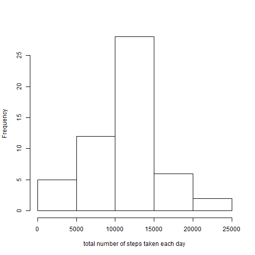
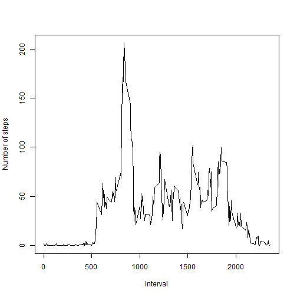
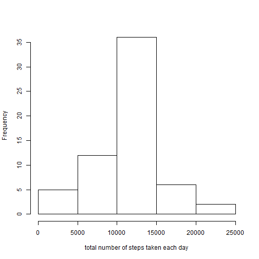
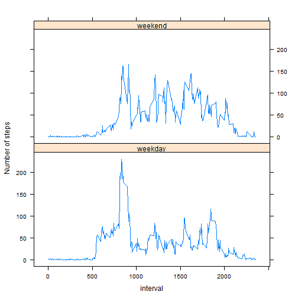

## Introduction
This assignment makes use of data from a personal activity monitoring device


## Data
`activity.csv` with three variables: `steps`, `date`, and `interval`


## Assignment


### Loading and preprocessing the data

1. Load the data

```r
x <- read.csv("activity.csv", header = TRUE)
```

2. Process/transform the data

- A: Not necessary


### Mean total number of steps taken per day

- Calculate the total number of steps taken per day


```r
daystep <- tapply(x$steps, x$date, sum)
daystep
```

```
## 2012-10-01 2012-10-02 2012-10-03 2012-10-04 2012-10-05 2012-10-06 
##         NA        126      11352      12116      13294      15420 
## 2012-10-07 2012-10-08 2012-10-09 2012-10-10 2012-10-11 2012-10-12 
##      11015         NA      12811       9900      10304      17382 
## 2012-10-13 2012-10-14 2012-10-15 2012-10-16 2012-10-17 2012-10-18 
##      12426      15098      10139      15084      13452      10056 
## 2012-10-19 2012-10-20 2012-10-21 2012-10-22 2012-10-23 2012-10-24 
##      11829      10395       8821      13460       8918       8355 
## 2012-10-25 2012-10-26 2012-10-27 2012-10-28 2012-10-29 2012-10-30 
##       2492       6778      10119      11458       5018       9819 
## 2012-10-31 2012-11-01 2012-11-02 2012-11-03 2012-11-04 2012-11-05 
##      15414         NA      10600      10571         NA      10439 
## 2012-11-06 2012-11-07 2012-11-08 2012-11-09 2012-11-10 2012-11-11 
##       8334      12883       3219         NA         NA      12608 
## 2012-11-12 2012-11-13 2012-11-14 2012-11-15 2012-11-16 2012-11-17 
##      10765       7336         NA         41       5441      14339 
## 2012-11-18 2012-11-19 2012-11-20 2012-11-21 2012-11-22 2012-11-23 
##      15110       8841       4472      12787      20427      21194 
## 2012-11-24 2012-11-25 2012-11-26 2012-11-27 2012-11-28 2012-11-29 
##      14478      11834      11162      13646      10183       7047 
## 2012-11-30 
##         NA
```

1. Histogram of the total number of steps taken each day


```r
hist(daystep,
     main = NA,
     xlab = "total number of steps taken each day")
```

 

2. The **mean** and **median** of the total number of steps taken per day

 

```r
me <- mean(daystep, na.rm = TRUE)
ma <- median(daystep, na.rm = TRUE)
```

- The **mean** of the total number of steps taken per day is **10766.19**

- The **median** of the total number of steps taken per day is **10765**


### The average daily activity pattern

1. A time series plot of the 5-minute interval (x-axis) and the average number of steps taken, averaged across all days (y-axis)


```r
dailystep <- tapply(x$steps, x$interval, mean, na.rm = TRUE)
dailystep <- data.frame(steps = dailystep,
                        interval = as.numeric(as.character(row.names(dailystep))))
with(dailystep, plot(interval, steps, type = "l", ylab = "Number of steps"))
```

 

2. Which 5-minute interval, on average across all the days in the dataset, contains the maximum number of steps?


```r
interval_max <- with(dailystep, interval[steps == max(steps)])
```
- The 5-minute interval is **835**


### Imputing missing values

1. Calculate and report the total number of missing values in the dataset (i.e. the total number of rows with NAs)

```r
nmiss <- sum(is.na(x$steps))
```
- The total number of missing values in the dataset is **2304**

2. Devise a strategy for filling in all of the missing values in the dataset.

- I use **the mean for that 5-minute interval** to replace the missing values


3. Create a new dataset that is equal to the original dataset but with the missing data filled in.

- I reuse data.frame `x`, and replace the missing values in `x$steps`

```r
x$steps <- ifelse(is.na(x$steps),
                    dailystep$steps[match(x$interval, dailystep$interval)],
                    x$steps)
```

4. Make a histogram of the total number of steps taken each day and Calculate and report the mean and median total number of steps taken per day. Do these values differ from the estimates from the first part of the assignment? What is the impact of imputing missing data on the estimates of the total daily number of steps?

- Calculate the total number of steps taken per day


```r
daystep <- tapply(x$steps, x$date, sum)
```

- Histogram of the total number of steps taken each day


```r
hist(daystep,
     main = NA,
     xlab = "total number of steps taken each day")
```

 

- The mean and median of the total number of steps taken per day


```r
me_adj <- mean(daystep, na.rm = TRUE)
ma_adj <- median(daystep, na.rm = TRUE)
```
- The **mean** of the total number of steps taken per day is **10766.19**. The value does not differ from the first part **10766.19** (because I replaced missing value with the mean for that 5 minute interval).

- The **median** of the total number of steps taken per day is **10766.19**. The value does differ from the first part **10765**

- Imputing missing data increases the estimates of the total daily number of steps (because I replaced NAs with some positive numbers)


### Are there differences in activity patterns between weekdays and weekends?

1. Create a new factor variable in the dataset with two levels - "weekday" and "weekend" indicating whether a given date is a weekday or weekend day.


```r
x$weekday <- ifelse(weekdays(as.Date(x$date)) %in% c("Sunday","Saturday"),"weekend", "weekday")
## Convert 'weekday' to a factor variable
x <- transform(x, weekday = factor(weekday))
```

2. Make a panel plot containing a time series plot of the 5-minute interval (x-axis) and the average number of steps taken, averaged across all weekday days or weekend days (y-axis).


```r
s <- split(x, x$weekday)  # s[[1]] is weekday, x[[2]] is weekend
dstep <- tapply(s[[1]]$steps, s[[1]]$interval, mean, na.rm = TRUE)
estep <- tapply(s[[2]]$steps, s[[2]]$interval, mean, na.rm = TRUE)

dstep <- data.frame(steps = dstep,
                    interval = as.numeric(as.character(row.names(dstep))),
                    weekday = "weekday")
estep <- data.frame(steps = estep,
                    interval = as.numeric(as.character(row.names(estep))),
                    weekday = "weekend")
xx <- rbind(dstep, estep)

library(lattice)
xyplot(steps ~ interval | weekday, data = xx, ylab = "Number of steps", type = "l", layout = c(1, 2))
```

 

### Dear graders, Thank you for reading and grading!
